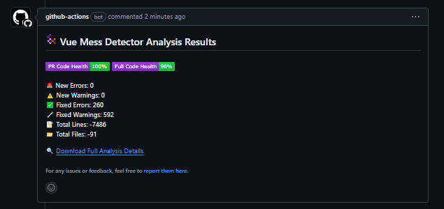

<!-- This file was generated from a .prp -->
<div align="center">

# Vue Mess Detector Action

_A static code analysis tool for detecting code smells and best practice
violations in Vue.js and Nuxt.js projects._


</div>

Easily integrate [Vue Mess Detector](https://github.com/rrd108/vue-mess-detector) into your CI pipeline to receive pull
request alerts and display badges effortlessly.

<details>
<summary>Pull Request Demo</summary>



</details>

## Installation

> [!TIP]
> Reference: [How to Use Vue Mess Detector](https://vue-mess-detector.webmania.cc/)

You can add this action as a step in your [GitHub Actions](https://github.com/features/actions)
workflow.
Here's an example of how to
use it:

<details>
<summary>pnpm</summary>

```yaml
name: VMD Analysis

on:
  workflow_dispatch:
  pull_request:
    branches:
      - main
  push:
    branches:
      - main

permissions:
  contents: read
  pull-requests: write

jobs:
  detect-mess:
    runs-on: ubuntu-latest
    name: Detect Vue Mess
    steps:
      - name: Checkout
        uses: actions/checkout@v4

      - uses: pnpm/action-setup@v4
        name: Install pnpm
        with:
          run_install: false
          version: 'latest' # delete this line if you have packageManager defined in package.json

      - name: Install Node.js
        uses: actions/setup-node@v4
        with:
          node-version: 20
          cache: 'pnpm'

      - name: Vue Mess Detector Analysis
        uses: brenoepics/vmd-action@v0.0.7
```

</details>

<details>
<summary>npm</summary>

```yaml
name: VMD Analysis

on:
  workflow_dispatch:
  pull_request:
    branches:
      - main
  push:
    branches:
      - main

permissions:
  contents: read
  pull-requests: write

jobs:
  detect-mess:
    runs-on: ubuntu-latest
    name: Detect Vue Mess
    steps:
      - name: Checkout
        uses: actions/checkout@v4

      - name: Install Node.js
        uses: actions/setup-node@v4
        with:
          node-version: 20

      - name: Vue Mess Detector Analysis
        uses: brenoepics/vmd-action@v0.0.7
```

</details>

<details>
<summary>yarn</summary>

```yaml
name: VMD Analysis

on:
  workflow_dispatch:
  pull_request:
    branches:
      - main
  push:
    branches:
      - main

permissions:
  contents: read
  pull-requests: write

jobs:
  detect-mess:
    runs-on: ubuntu-latest
    name: Detect Vue Mess
    steps:
      - name: Checkout
        uses: actions/checkout@v4

      - name: Install Node.js
        uses: actions/setup-node@v4
        with:
          node-version: 20
          cache: 'yarn'

      - name: Vue Mess Detector Analysis
        uses: brenoepics/vmd-action@v0.0.7
```

</details>

<details>
<summary>bun</summary>

```yaml
name: VMD Analysis

on:
  workflow_dispatch:
  pull_request:
    branches:
      - main
  push:
    branches:
      - main

permissions:
  contents: read
  pull-requests: write

jobs:
  detect-mess:
    runs-on: ubuntu-latest
    name: Detect Vue Mess
    steps:
      - name: Checkout
        uses: actions/checkout@v4

      - name: Install Bun
        uses: oven-sh/setup-bun@v2
        with:
          bun-version: 'latest'

      - name: Vue Mess Detector Analysis
        uses: brenoepics/vmd-action@v0.0.7
```

</details>

## Usage

See [action.yml](action.yml)

<!-- start usage -->
```yaml
- uses: brenoepics/vmd-action@v0.0.7
  with:
    # Personal access token (PAT) used to fetch the repository. The PAT is
    # configured with the local git config, which enables your scripts to run
    # authenticated git commands. The post-job step removes the PAT.
    #
    # We recommend using a service account with the least permissions necessary.
    # Also when generating a new PAT, select the least scopes necessary.
    #
    # [Learn more about creating and using encrypted
    # secrets](https://help.github.com/en/actions/automating-your-workflow-with-github-actions/creating-and-using-encrypted-secrets)
    github-token: ''

    # Version of Vue Mess Detector to use. This can be a specific version number
    # or 'latest' to use the most recent version available.
    version: ''

    # If set to 'true', the action will skip the installation of Vue Mess Detector.
    # This can be useful if Vue Mess Detector is already installed in your environment.
    skipInstall: ''

    # If set to 'true', the action will skip running analysis on pull requests
    # created by bots. This can help reduce unnecessary analysis runs.
    skipBots: ''

    # If set to 'true', the action will post comments on pull requests with the
    # results of the analysis. If set to 'false', no comments will be posted.
    commentsEnabled: ''

    # The package manager to use for installing dependencies. Supported values
    # are 'npm', 'yarn', 'pnpm', and 'bun'. If not specified, the action will
    # attempt to detect the package manager based on the lock file present in
    # the repository.
    packageManager: ''

    # Additional arguments to pass to Vue Mess Detector when running the analysis.
    # This can be used to customize the behavior of the analysis.
    runArgs: ''

    # The entry point for Vue Mess Detector. This is the directory where the
    # analysis will start. If not specified, the current directory will be used.
    entryPoint: ''

    # The source directory to analyze. This should be the path to the directory
    # containing the source code you want to analyze. If not specified, 'src/'
    # will be used.
    srcDir: ''

    # If set to 'true', the action will delete old comments on pull requests
    # before posting new ones. This can help keep the comment section clean.
    deleteOldComments: ''

    # If set to 'true', the action will generate a report comparing the current
    # branch with the target branch. This can be useful for identifying changes
    # introduced in a pull request.
    relativeMode: ''
```
<!-- end usage -->

## Inputs

> [!TIP]
> You can find the list of inputs and their descriptions in the [action.yml](action.yml) file.

| Input             | Description                                          | Required | Default                                                 |
|-------------------|------------------------------------------------------|----------|---------------------------------------------------------|
| github-token      | GitHub token for commenting on pull requests         | `false`  | `github.token`                                          |
| version           | Version of Vue Mess Detector                         | `true`   | [`latest`](https://github.com/rrd108/vue-mess-detector) |
| skipInstall       | Skip the installation of Vue Mess Detector           | `true`   | `false`                                                 |
| skipBots          | Skip running analysis on pull requests from bots     | `true`   | `true`                                                  |
| commentsEnabled   | Comment on Pull requests?                            | `true`   | `true`                                                  |
| packageManager    | Package manager to use                               | `false`  | (detect)                                                |
| runArgs           | Arguments to pass to Vue Mess Detector               | `false`  | `--group=file`                                          |
| entryPoint        | Entry point for Vue Mess Detector                    | `false`  | `./`                                                    |
| srcDir            | Source directory to analyze                          | `true`   | `src/`                                                  |
| deleteOldComments | Delete old report comments on pull requests?         | `false`  | `false`                                                 |
| relativeMode      | Compare the current branch with the target (PR only) | `true`   | `true`                                                  |

## Contributing

We welcome contributions to this project! Please read our [Contributing Guide](CONTRIBUTING.md) for more information on
how to contribute.

If you've found this project useful, please consider giving it a ⭐ on GitHub.
This helps to spread the awareness of the
project and is a great way to show your support!

## License

This project is licensed under the MIT License.
